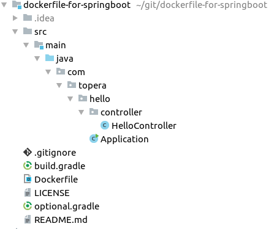

# Topera's Hello World #018
## Dockerfile used to deliver SpringBoot application, with Gradle
This hello world shows how to use Docker to deploy the jar of a SpringBoot application

## How to download this source code
* Use the `Clone or download` button above the get the url of this repository
* In IntelliJ IDEA: File → New → Project From Version Control → Git → put the url of this repository

## How to test locally
* Generated the jar with the application:
    * `$ gradle bootJar`
* Create a new Docker Image using the Dockerfile, to encapsulate the jar:
    * `$ docker build -t topera/hello .`
        * The syntax of `-t` is USERNAME/REPOSITORY
* Run the new Docker Image:
    * `$ docker run -d -p 8080:8080 --name hello topera/hello`
* Wait some seconds and access http://localhost:8080/test

## How to deploy on AWS
* There are many ways:
    * Using Elastic Beanstalk
        * Create a jar file with only 2 files, following this structure:
        * `Dockerfile`
        * `build/libs/dockerfile-for-springboot.jar`
            * Please take care that the Dockerfile is the root of the jar, not inside a subfolder
        * `AWS` → `Elastic Beanstalk` → Follow step to deploy a docker
    * Using ECS (Elastic Container Service)
        * Please follow instructions. It's complex :)
## How to share your docker image
* We can share using DockerHub. Lets push the image to the repository
    * `$ docker login -u topera -p MY_SECRET_PASS_HERE`
    * `$ docker push topera/hello`
* It's available here:
    * https://hub.docker.com/r/topera/hello/
* Anyone can install it using:
    * `docker pull topera/hello`
* You can also create an AUTOMATED BUILD project in Docker Hub, which will listen your GitHub and creates new images automatically
    * In this case, we need to adjust our Dockerfile. Please take a look in Dockerfile-dockerhub.

## How to automatize these operations
* I created a file called `docker.gradle` which has a lot of operations to automatize the steps above. With them we can easily create a Continuous Delivery environment.
* To generate a new package in DockerHub, just run:
    * `$ gradle publishImage`
* To run you app locally
    * `$ gradle runContainer`
* Other operations
    * `$ gradle createImage`
    * `$ gradle deleteImage`
    * `$ gradle stopContainer`
    * `$ gradle deleteContainer`

## Folder Structure

## Tech Stack
* IDE: IntelliJ IDEA 2018.1
* Build system: Gradle 4.7
* Back-end: Java 1.8.0, Spring Boot 2.0.1
* Docker version 18.03.1-ce

To take a look in other projects, please see https://github.com/topera/index

