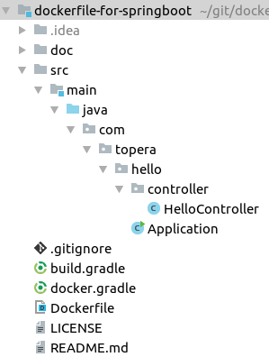

# Topera's Hello World #018
## Dockerfile used to deliver SpringBoot application, with Gradle
This hello world shows how to use Docker to deploy the jar of a SpringBoot application

## How to download this source code
* Use the `Clone or download` button above the get the url of this repository
* In IntelliJ IDEA: File → New → Project From Version Control -> Git -> put the url of this repository

## How to test locally
* Generated the jar with the application:
    * `$ gradle bootJar`
* Create a new Docker Image using the Dockerfile, to encapsulate the jar:
    * `$ docker build -t hello:1.0 .`
        * The syntax of `-t` is <username>/<repository>:<version>
* Run the new Docker Image:
    * `$ docker run -p 8080:8080 --name hello hello:1.0 -d`
* Wait some seconds and access http://localhost:8080/test

## How to deploy on AWS
* There are many ways. One of them is to create a jar file with only 2 files, following this structure:
    * `Dockerfile`
    * `build/libs/dockerfile-for-springboot.jar`
        * Please take care that the Dockerfile is the root of the jar, not inside a subfolder
* Then, in `AWS` -> `Elastic Beanstalk` -> Follow step to deploy a docker

## How to share your docker image
* We can share using DockerHub. My username is called "topera", so I need to tag my image with this username
    * `$ docker tag hello:1.0 topera/hello:1.0`
* Now I can push my image to my public repository
    * `$ docker push topera/hello:1.0`
* It's available here:
    * https://hub.docker.com/r/topera/hello/
* Anyone can install it using:
    * `docker pull topera/hello:1.0`

## Folder Structure

## Tech Stack
* IDE: IntelliJ IDEA 2018.1
* Build system: Gradle 4.7
* Back-end: Java 1.8.0, Spring Boot 2.0.1
* Docker version 18.03.1-ce

To take a look in other projects, please see https://github.com/topera/index

